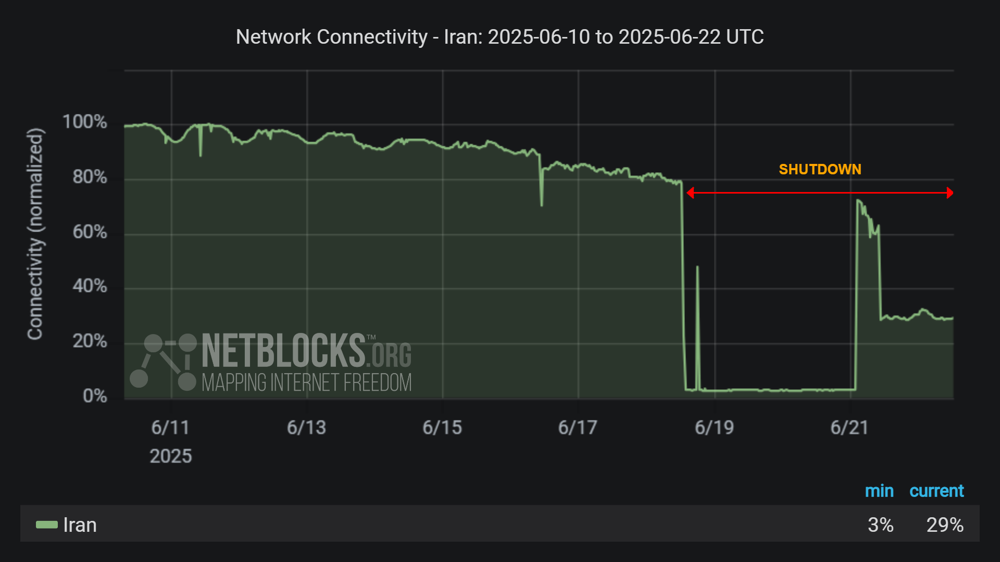

# Iran Internet Shutdown – June 2025  
A comprehensive technical and data-driven analysis of the nationwide blackout and the deployment of Iran's "Great Firewall" during the June 2025 conflict.

---

## 📌 Overview

This repository provides a detailed report on the Iranian internet shutdown during the June 2025 conflict, featuring:

- Timeline of blackout events
- Technical analysis of DPI, BGP blackholing, and domestic whitelisting
- Data from NetBlocks, Cloudflare Radar, IODA, and Kentik
- Charts showing traffic drops and shutdown duration

---

## 📂 File Structure

```
iran-internet-shutdown-2025-analysis/
├── README.md ← This file
├── report.md ← Full article with sources, charts, and analysis
├── LICENSE ← MIT License
└── data/
├── netblocks_traffic.png
├── ioda_google_access.png
└── cloudflare_drop.png

```

---

## 📊 Quick Preview



> 📉 Internet connectivity dropped to ~3% of baseline during peak blackout.

---

## ✍️ Author

- **Arash Aryapour**  
  [GitHub Profile](https://github.com/arash-aryapour)

---

## 📄 License

This project is licensed under the [MIT License](./LICENSE).

---

## 📬 Feedback & Contributions

Feel free to fork, suggest improvements, or contribute translations.

