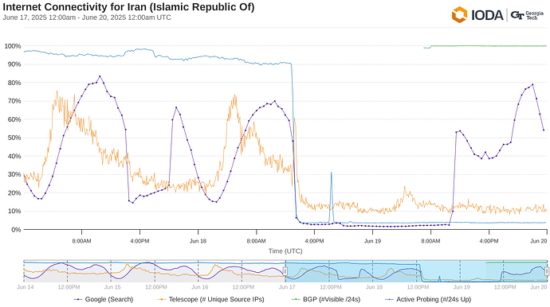
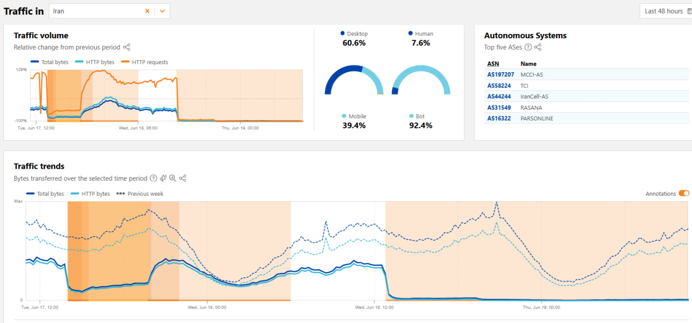

# قطعی اینترنت ایران – ژوئن ۲۰۲۵  
## تحلیلی فنی و داده‌محور از راهبرد انزواسازی شبکه‌ای ایران در زمان جنگ (IR-GFW)

---

## چکیده

در ژوئن ۲۰۲۵، ایران دست به قطع سراسری و بی‌سابقه اینترنت زد که همزمان با تشدید درگیری‌های نظامی، منجر به جدایی تقریباً کامل از اینترنت جهانی شد. این مقاله، بررسی جامع و جنبه‌به‌جنبه‌ای از معماری فنی این قطع اینترنت ارائه می‌کند و از داده‌های تله‌متری منابع مختلف از جمله NetBlocks، Cloudflare Radar، Kentik و IODA بهره می‌برد. ما به تحلیل دستکاری‌های مسیرهای BGP، روش‌های فیلترینگ DPI، تکنیک‌های مسدودسازی VPN و به‌کارگیری راهبردی لیست سفید شبکه داخلی پرداخته‌ایم. همچنین پیامدهای ژئوپلیتیکی و اقتصادی-اجتماعی این رخداد را بررسی و درباره تأثیرات بلندمدت آن بر حاکمیت دیجیتال ایران گمانه‌زنی می‌کنیم.

---

## ۱. مقدمه

تابستان ۲۰۲۵ شاهد شدت گرفتن چشمگیر درگیری‌های ایران و اسرائیل بود که با حملات هوایی هدفمند به زیرساخت‌های حیاتی نظامی و هسته‌ای ایران همراه شد. در پاسخ، مقامات ایرانی دست به اجرای یک انزواسازی شبکه‌ای سراسری زدند که در این مقاله با عنوان IR-GFW (دیوار آتش بزرگ ایران) شناخته می‌شود. برخلاف دیوار آتش دائمی چین، IR-GFW یک محاصره دیجیتال اضطراری در زمان جنگ بود که با ترکیبی از فیلترینگ چندلایه و عقب‌نشینی زیرساختی، خاموشی دیجیتال تقریباً کامل را اعمال کرد. این تحلیل داده‌های تله‌متری از نهادهای مستقل سنجش اینترنت را گردآوری کرده تا جدول زمانی و جزئیات فنی این قطع اینترنت را بازسازی کند.

---

## ۲. روش‌شناسی و منابع داده

- **NetBlocks**: نهاد رصد جهانی اینترنت که اختلالات اتصال را از طریق ترسرَوت، تحلیل DNS و آزمون‌های وب پایش می‌کند.  
- **Cloudflare Radar**: پلتفرم تحلیل ترافیک که روندهای IP منطقه‌ای و جهانی و تشخیص ناهنجاری‌ها را ارائه می‌دهد.  
- **Kentik**: پلتفرم تحلیل شبکه با رصد BGP، داده‌های جریان (flow data) و آمار اتصال.  
- **IODA (پروژه تشخیص و تحلیل قطع اینترنت)**: پروژه دانشگاه جورجیا تک که از پروب‌های فعال برای شناسایی قطعی اینترنت استفاده می‌کند.  

داده‌ها در بازه ۱۰ ژوئن تا ۲۵ ژوئن ۲۰۲۵ گردآوری شد تا خطوط پایه پیش از درگیری، آغاز قطع و مراحل بازیابی جزئی ثبت شود.

---

## ۳. جدول زمانی و بازسازی رخدادها

| تاریخ      | شرح رویداد                                    | شاخص‌های شبکه                       |
|------------|----------------------------------------------|------------------------------------|
| ۱۳ ژوئن    | حملات هوایی اسرائیل به اهداف ایرانی         | حدود ۵۴٪ کاهش در ترانزیت خارجی از طریق Kentik |
| ۱۴-۱۶ ژوئن | وخامت تدریجی شبکه                            | بی‌ثباتی مسیریابی و ریست‌های موقت DPI |
| ۱۷ ژوئن    | آغاز فروپاشی کامل شبکه                       | گزارش NetBlocks از کاهش ۹۷٪ اتصال |
| ۱۸-۱۹ ژوئن | پایداری خاموشی اینترنت                       | تنها ترافیک اینترانت داخلی (~۳٪ جهانی) |
| ۲۱ ژوئن    | بازیابی جزئی موقت (حدود ۲ ساعت)             | جهش ترافیک Cloudflare و سپس ریست مجدد |
| ۲۲-۲۵ ژوئن | ادامه خاموشی پایدار                          | اختلال شدید در VPN و ریست‌های مکرر TCP |

---

## ۴. تحلیل فنی

### ۴.۱ دستکاری مسیرهای BGP

- شرکت‌های ارائه‌دهنده اینترنت در ایران، پیشوندهای BGP جهانی را پس کشیدند که منجر به حذف ASهای ایرانی از جدول‌های مسیریابی جهانی شد.  
- عقب‌نشینی مسیرها بر ارائه‌دهندگان Tier-1 (مانند Level 3 و Tata Communications) متمرکز بود تا ارتباطات بین‌المللی را قطع کنند.  
- اعلام‌های جزئی مسیرها برای حفظ دسترسی به شبکه ملی اطلاعات (NIN) ادامه داشت.

### ۴.۲ بازرسی عمیق بسته‌ها (DPI) و فیلترینگ

- تجهیزات DPI مستقر در نقاط تبادل اینترنت (IXP) ملی، پروتکل‌های VPN (OpenVPN، WireGuard) و DNS رمزنگاری‌شده (DoH/DoT) را هدف قرار دادند.  
- تکنیک‌های تزریق TCP Reset جلسات مشکوک را به اجبار بستند.  
- فیلترینگ SNI (Server Name Indication) در دست‌دهی TLS به‌کار گرفته شد تا دسترسی به سرویس‌های خارجی ممنوعه مسدود شود.  
- مسموم‌سازی DNS دامنه‌های خارجی را به آدرس‌های داخلی یا بن‌بست هدایت کرد.

### ۴.۳ مقابله با VPN و پروکسی‌ها

- بررسی فعال ترافیک VPNهای مخفی (Obfs4، Shadowsocks) منجر به افزایش اختلالات اتصال شد.  
- تکنیک‌های اثرانگشت‌برداری رفتاری، الگوهای دست‌دهی غیرعادی را شناسایی و منجر به ریست شدند.  
- گزارش‌هایی از استفاده از طبقه‌بندی‌کننده‌های DPI مبتنی بر یادگیری ماشین برای شناسایی ابزارهای دور زدن فیلتر موجود است.

### ۴.۴ لیست سفید و سامانه‌های تشخیص نفوذ

- لیست سفید کامل اعمال شد؛ تنها ترافیک به سمت IPها و سرویس‌های مورد تأیید دولت مجاز بود.  
- سامانه‌های تشخیص نفوذ (IDS) الگوهای مشکوک را رصد کرده و قواعد مسدودسازی بلادرنگ اعمال می‌کردند.  
- پلتفرم‌های داخلی حیاتی (تجارت الکترونیک، شبکه‌های اجتماعی، بانکداری) از طریق شبکه ملی بسته منتقل می‌شدند.

---

## ۵. مصورسازی داده‌ها

### ۵.۱ شاخص اتصال NetBlocks

- نشان‌دهنده سقوط تند دسترسی شبکه از ۱۰۰٪ به حدود ۳٪ طی چهار روز است.  
- همبستگی زمانی با عملیات نظامی گزارش‌شده دارد.

### ۵.۲ شاخص‌های پروب فعال IODA

- آزمون‌های DNS گوگل بازیابی‌های جزئی مقطعی را نشان می‌دهند که دوباره به وضعیت قطع کامل بازمی‌گردد.  
- مسموم‌سازی DNS و مسدودسازی انتخابی را تأیید می‌کند.

### ۵.۳ تحلیل ترافیک Cloudflare

- داده‌های ترافیک منطقه‌ای با تله‌متری جهانی هم‌خوان است و کاهش ترافیک ۹۵-۹۷٪ را نشان می‌دهد.  
- جهش در ۲۱ ژوئن نشانه پنجره کوتاه بازیابی اتصال است.

---

## ۶. پیامدهای ژئوپلیتیکی و اقتصادی-اجتماعی

- **قطع ارتباطات، هماهنگی‌های مردمی در بحران را شدیداً مختل کرد.**  
- **خدمات مالی از جمله بانک سپه و صرافی رمز ارز Nobitex عملیات خارجی خود را متوقف کردند که منجر به بحران نقدینگی شد.**  
- **محکومیت بین‌المللی توسط عفو بین‌الملل و گزارشگران بدون مرز، نقض حقوق دیجیتال و نگرانی‌های بشردوستانه را مطرح کرد.**  
- **پیشینه جدیدی از سانسور باعث نگرانی درباره حکمرانی دیجیتال ایران و احتمال انزوای طولانی‌مدت در قالب «اسپلینترنت» شده است.**

---

## ۷. مقابله‌ها و مداخلات خارجی

- ماهواره‌های استارلینک ایلان ماسک به‌صورت جزئی تأثیر خاموشی را در مناطق مرزی کاهش دادند.  
- تلاش‌های پارازیت مقامات ایرانی، دریافت سیگنال‌های ماهواره‌ای در شهرها را محدود کرد.  
- شبکه‌های مش مش زیرزمینی و اپلیکیشن‌های همتا به همتا رشد جزئی در استفاده داشتند.

---

## ۸. نتیجه‌گیری و چشم‌انداز

قطع اینترنت ایران در ژوئن ۲۰۲۵، نمایانگر تحول در کنترل شبکه‌ای در سطح دولت است؛ راهبردی در زمان جنگ که سانسور سنتی را با انزوای زیرساختی در سطح بک‌بون ترکیب می‌کند. این رویداد، نشانه تغییر پارادایم به سوی حاکمیت دیجیتال ملی از طریق تقسیم‌بندی فنی اینترنت جهانی است. احتمال می‌رود در منازعات آینده نیز رویکردهای مشابهی به‌کار گرفته شود که پیامدهایی برای حکمرانی اینترنت، امنیت سایبری و آزادی‌های مدنی در سطح جهان دارد.

---

## ۹. منابع

- NetBlocks. «گزارش قطع اینترنت ایران، ژوئن ۲۰۲۵.» [NetBlocks.org](https://netblocks.org)  
- Cloudflare Radar. «تحلیل ترافیک منطقه‌ای.» [Cloudflare.com/radar](https://radar.cloudflare.com)  
- Kentik Labs. «تحلیل داده‌های BGP و جریان، ژوئن ۲۰۲۵.» [Kentik.com](https://kentik.com)  
- IODA Project. «پروژه تشخیص و تحلیل قطعی اینترنت.» [Ioda.gatech.edu](https://ioda.gatech.edu)  
- عفو بین‌الملل. «ایران: نقض حقوق دیجیتال در جریان درگیری ۲۰۲۵.»  
- گزارشگران بدون مرز. «قطع اینترنت و حقوق بشر.»  
- The Verge، TechCrunch، Wired — مقالات مختلف درباره قطع اینترنت ایران
